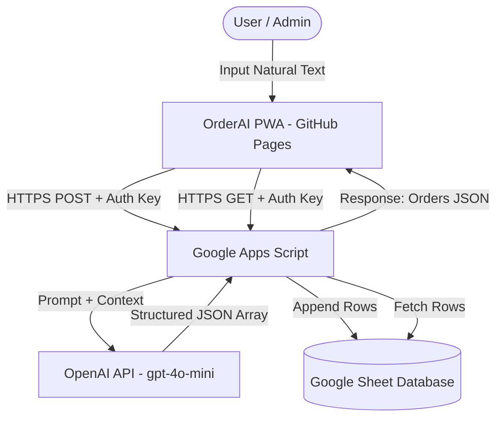

# OrderAI PWA 🚀

OrderAI is a serverless, premium Progressive Web Application (PWA) designed to manage sales orders through natural language text. 
By typing a simple note (e.g., `"3 bánh mì 60k cho khách Nam"`), the integrated OpenAI-backed engine parses the text and automatically appends structured records directly to a Google Sheets database.

---

## 🏗️ System Architecture



---

## 💻 Local Development Setup

To run and customize the frontend application on your local machine, follow these steps:

### Prerequisites
Make sure you have [Node.js](https://nodejs.org/) (version 18 or newer) installed.

### Step-by-Step Local Deployment
1. **Clone the Repository:**
   ```bash
   git clone <your-repo-url>
   cd order-with-ai
   ```

2. **Install Dependencies:**
   ```bash
   npm install
   ```

3. **Start Development Server:**
   ```bash
   npm run dev
   ```
   This will boot up Vite and provide a local address (typically `http://localhost:5173`). Open this link in your browser to interact with the application.

4. **Verify Application Build:**
   ```bash
   npm run build
   ```
   This ensures the application builds correctly for production, outputting a static build to the `dist/` directory, complete with service workers and PWA assets.

---

## ☁️ Google Cloud & Apps Script Setup (The Serverless Backend)

Follow these exact steps to configure your serverless database and natural language parser:

### 1. Google Sheets Configuration
1. Create a new Google Sheet on your Google Drive.
2. Rename the active sheet tab to exactly: **`Orders`**.
3. Create the headers in **Row 1** exactly as follows (columns A through G):
   * Column A: `Timestamp`
   * Column B: `Customer Name`
   * Column C: `Item Name`
   * Column D: `Quantity`
   * Column E: `Price Unit`
   * Column F: `Total Price`
   * Column G: `Raw Note`

### 2. Google Apps Script Configuration
1. In your Google Sheet, click on the top menu: **Extensions > Apps Script**.
2. Delete any boilerplate code inside the editor.
3. Open the file [backend.js](backend.js) in your repository, copy its entire contents, and paste it into the Apps Script editor.
4. Save the project (click the disk icon or press `Cmd+S` / `Ctrl+S`).

### 3. Add Environment Variables (Script Properties)
1. In the Apps Script dashboard, click on the **Project Settings** (the gear icon on the left sidebar).
2. Scroll down to the **Script Properties** section.
3. Click **Add script property** and add these two key-value pairs:
   * **Property:** `OPENAI_API_KEY`  
     **Value:** *[Your OpenAI API Key]*
   * **Property:** `APP_PASSWORD`  
     **Value:** *[Choose a secure password she will use to login to the app]*
4. Click **Save script properties**.

### 4. Deploy as a Web App
1. Click the blue **Deploy** button at the top right, then select **New deployment**.
2. Click the gear icon next to "Select type" and choose **Web app**.
3. Fill in the deployment details:
   * **Description:** `OrderAI Web App Backend`
   * **Execute as:** **Me** (your Google account)
   * **Who has access:** **Anyone** (this is necessary so the PWA can send POST/GET requests; authentication is verified securely via your `APP_PASSWORD` in the headers).
4. Click **Deploy**.
5. Copy the generated **Web app URL**. It should look like:
   `https://script.google.com/macros/s/AKfycb.../exec`

---

## 🚀 PWA Production Deployment (GitHub Pages)

The PWA is configured to automatically build and deploy to GitHub Pages using GitHub Actions.

1. **Push Code to GitHub:**
   ```bash
   git add .
   git commit -m "feat: complete order-with-ai source code and documentation"
   git branch -M main
   git remote add origin <your-github-repo-url>
   git push -u origin main
   ```
2. **Enable GitHub Pages:**
   * Go to your repository on GitHub.
   * Click **Settings > Pages** on the left menu.
   * Under **Build and deployment**, select:
     * **Source:** **GitHub Actions**
3. The configured [GitHub workflow](.github/workflows/deploy.yml) will trigger instantly, building the React app and publishing it. Once completed, your live URL will be active at `https://<your-username>.github.io/<your-repo-name>/`.

---

## 📲 Initial App Launch & Setup

Once both the Web App and PWA are deployed, follow these steps to connect them:

1. **Install PWA on Phone:**
   * Open the live GitHub Pages PWA URL in Safari (iOS) or Chrome (Android).
   * Tap the **Share** button (iOS) or the **Menu** icon (Android) and select **Add to Home Screen**.
   * Launch the app from your home screen.
2. **Authenticate:**
   * Enter the secure `APP_PASSWORD` you configured in your Script Properties.
3. **Configure Settings:**
   * Tap the **Settings (gear icon)** at the top right.
   * Paste your copied **Google Apps Script Web App URL** in the field.
   * Click **Save Changes**.
4. **Test the Flow:**
   * Try entering: `"3 bánh mì 60k cho khách Nam"` or `"2 cà phê sữa 50k"`.
   * Tap **Save Order**.
   * Switch to the **Management** tab to see today's totals, monthly metrics, and item breakdown dynamically computed!
